<p align="center">
  
</p>

<p align="center">
  <b>Codex stays in charge of the thread. Claude Code does the heavy lifting.</b><br/>
  Read-only reviews, adversarial design critiques, tracked rescue tasks, and full thread transfers —
  all driven from inside Codex by the <code>claude</code> CLI.
</p>

<p align="center">
  <a href="#-quick-start"></a>
  
  
  
</p>

<p align="center">
  <a href="#-quick-start"><strong>Quick Start</strong></a> ·
  <a href="#-whats-different-in-this-fork"><strong>Why this fork</strong></a> ·
  <a href="#-commands"><strong>Commands</strong></a> ·
  <a href="#-background-jobs"><strong>Background Jobs</strong></a> ·
  <a href="#-review-gate"><strong>Review Gate</strong></a> ·
  <a href="#-credits"><strong>Credits</strong></a>
</p>

---

## What is this?

`claude-in-codex` turns **Codex** into a host for **Claude Code** work. You keep driving your Codex
thread; when you want a second pair of eyes or a task done, you delegate it to Claude with a `$cc:`
command. Claude runs read-only reviews, challenges your design, fixes bugs, or picks up the whole
conversation in a fresh session — and the result comes back to you inside Codex.

It follows the shape of [openai/codex-plugin-cc](https://github.com/openai/codex-plugin-cc) (which runs
Codex *inside* Claude Code) but points the other way, and builds on the production-grade
[sendbird/cc-plugin-codex](https://github.com/sendbird/cc-plugin-codex) foundation.

```text
$cc:review                    # ask Claude to review your current diff
$cc:rescue fix the flaky test # hand Claude a task
$cc:transfer                  # continue this whole thread in a fresh Claude session
```

---

## ✨ What's different in this fork

This fork adds three things on top of the upstream `sendbird/cc-plugin-codex`:

| | Upstream | **claude-in-codex** |
| --- | --- | --- |
| 🔒 **Review gate & read-only tasks** | git access via a `Bash(git …)` allowlist entry | **Bash-free** — git reads go through a sandboxed read-only git MCP server, so no full-Bash surface is opened in a network-open sandbox |
| 🔁 **Thread transfer** | — | **`$cc:transfer`** carries the current Codex thread into a fresh Claude Code session and prints the exact `claude --resume` to continue |
| 🔎 **Default review depth** | thin inline prompt | **structured prompt** with a severity taxonomy + JSON output schema, returning severity-sorted findings |

> **Why the security fix matters:** the Claude CLI treats *any* `Bash` allowlist entry as opening the
> **entire** `Bash` tool. Combined with a read-only sandbox that still allows network, that's an
> exfiltration surface. This fork grants git *reads* through a bundled MCP server
> (`mcp__gitReview__*`) with `--strict-mcp-config` instead — no `Bash` entry anywhere in the
> stop-gate or read-only task paths.

See the [CHANGELOG](CHANGELOG.md) for the full `v1.3.0` notes.

---

## 🚀 Quick Start

### 1. Install

> **Prerequisites:** Node.js 18+, Codex with plugin/hook support, and the `claude` CLI installed and
> authenticated. Don't have Claude yet?
> ```bash
> npm install -g @anthropic-ai/claude-code && claude auth login
> ```

This repo *is* its own Codex marketplace — add it and install the `cc` plugin straight from it. No
third-party marketplace involved:

```bash
codex plugin marketplace add MacWulf/claude-in-codex
codex plugin add cc@claude-in-codex
```

Prefer a local checkout? Point Codex at the cloned directory instead:

```bash
git clone https://github.com/MacWulf/claude-in-codex.git
codex plugin marketplace add ./claude-in-codex
codex plugin add cc@claude-in-codex
```

The plugin installs under Codex's plugin cache and loads its hooks from `hooks/hooks.json` via
`$PLUGIN_ROOT`.

### 2. Verify

Open Codex and run:

```text
$cc:setup
```

`$cc:setup` checks that Claude Code is installed and authenticated, enables the required Codex feature
gates (`[features].hooks` + `[features].plugin_hooks`), and trusts this plugin's hook hashes. If
anything's missing, it tells you exactly what to fix.

### 3. Try it

```text
$cc:review --background
$cc:status
$cc:result
```

That launches a background Claude review, then checks on it. When it finishes, Codex nudges you toward
the result.

---

## 📋 Commands

| Command | What it does |
| --- | --- |
| `$cc:review` | Read-only Claude Code review of your changes (structured, severity-sorted) |
| `$cc:adversarial-review` | Design-challenging review — questions approach, tradeoffs, hidden assumptions |
| `$cc:rescue` | Hand a task to Claude Code — bugs, fixes, investigations, follow-ups |
| `$cc:transfer` | Start a fresh Claude Code session from the current Codex thread transcript |
| `$cc:status` | List running and recent Claude Code jobs, or inspect one |
| `$cc:result` | Open the output of a finished job |
| `$cc:cancel` | Cancel an active background job |
| `$cc:setup` | Verify installation, auth, hooks, and the review gate |

**Routing rule of thumb:**
- `$cc:review` — straightforward correctness review of the current diff.
- `$cc:adversarial-review` — riskier config/migration/design changes, or when you want assumptions challenged.
- `$cc:rescue` — when you want Claude to investigate, change code, or actually fix/implement something.
- `$cc:transfer` — when you want to pick up the current Codex thread in a fresh Claude Code session.

### `$cc:review`

Standard read-only review of your current work, isolated in an ephemeral `git worktree` with a
read-only git MCP server.

```text
$cc:review                        # review uncommitted changes (default: opus + CLI-selected effort)
$cc:review --base main            # review branch vs main
$cc:review --scope branch         # compare branch tip to base
$cc:review --background           # run in background, check with $cc:status later
$cc:review --model sonnet         # switch to sonnet (defaults to high effort)
```

**Flags:** `--base <ref>`, `--scope <auto|working-tree|branch>`, `--wait`, `--background`, `--model <model>`, `--effort <auto|low|medium|high|xhigh|max>`

**Defaults:** model `opus`, with effort unset so the Claude CLI selects the appropriate level for
the current model. `sonnet` and `haiku` are also delegated to Claude CLI aliases. Use
`--effort auto` to make this behavior explicit. Any full model ID passed to `--model` is forwarded
verbatim, so a newer model works without an update; the three aliases can also be retargeted via the
`CC_PLUGIN_CODEX_MODEL_OPUS` / `CC_PLUGIN_CODEX_MODEL_SONNET` / `CC_PLUGIN_CODEX_MODEL_HAIKU` env
vars. Findings come back on a `critical / high / medium / low` severity scale, sorted by severity.

Scope `auto` (default) inspects `git status` and chooses working-tree vs branch automatically. Very
large diffs degrade gracefully to compact status/stat context, with Claude directed to inspect the
diff through read-only git tools.

### `$cc:adversarial-review`

Same isolation as `$cc:review`, but steers Claude to challenge the implementation — tradeoffs,
alternative approaches, hidden assumptions. Accepts the same flags plus free-text focus after the
flags.

```text
$cc:adversarial-review
$cc:adversarial-review --background question the retry and rollback strategy
$cc:adversarial-review --base main challenge the caching design
```

### `$cc:rescue`

Hand a task to Claude Code — the main way to delegate real work.

```text
$cc:rescue investigate why the tests started failing
$cc:rescue fix the failing test with the smallest safe patch
$cc:rescue --resume apply the top fix from the last run
$cc:rescue --background investigate the regression
```

| Flag | Description |
| --- | --- |
| `--background` / `--wait` | Run in background (check later) / foreground |
| `--resume` / `--resume-last` | Continue the most recent Claude Code task |
| `--fresh` | Force a new task (don't resume) |
| `--write` | Allow file edits (default) |
| `--model <model>` | `opus`, `sonnet`, `haiku`, or a full ID (default `opus`) |
| `--effort <level>` | `auto`, `low` … `max` (default `auto`, delegated to Claude CLI) |
| `--prompt-file <path>` | Read the task description from a file |

If you don't pass `--resume` or `--fresh`, rescue detects a resumable Claude session and asks once
whether to continue or start fresh — your phrasing guides the recommendation.

### `$cc:transfer`

Carry the current Codex thread into a **fresh Claude Code session**. On success it prints the exact
command to resume that session:

```text
$cc:transfer
claude --resume <session-id>
```

**Flags:** `--wait`, `--background`, `--model <model>`, `--effort <…>`, `--source <path>`, `--prompt-file <path>`

Transfer resolves the current Codex thread id from the plugin's session context (`CODEX_THREAD_ID`)
and reads history through Codex app-server `thread/read` + `thread/items/list`. The transcript is
wrapped as **untrusted context** before it reaches Claude. If the app-server transcript is
unavailable, pass one directly:

```text
$cc:transfer --source /path/to/transcript.txt
```

### `$cc:status` · `$cc:result` · `$cc:cancel`

```text
$cc:status                    # active + recent jobs for this session
$cc:status --all              # all tracked jobs in this repo workspace
$cc:status --wait task-abc123 # block until a job completes
$cc:result                    # open the latest finished job
$cc:result task-abc123        # show a specific finished job
$cc:cancel task-abc123        # cancel a running job
```

A finished background job can surface both the **Claude Code session** (resume with
`claude --resume <session-id>`) and the **owning Codex session** that tracks the job.

### `$cc:setup`

```text
$cc:setup                        # verify everything
$cc:setup --enable-review-gate   # turn on the stop-time review gate
$cc:setup --disable-review-gate  # turn it off
```

---

## ⚙️ Background Jobs

Every review and rescue command supports `--background`. Background jobs are tracked per-session with
full lifecycle management:

- **Queued → Running → Completed**, tracked automatically.
- **Built-in subagent flows** — background rescue/review run through Codex-managed subagent turns.
- **Completion nudges** — when a job finishes, the plugin points the parent thread at the right
  `$cc:result <job-id>`; the unread-result hook is the backstop if the nudge can't surface.
- **Session ownership** — jobs stay attached to the user-facing Codex session even when a child does
  the work, so plain `$cc:status` / `$cc:result` follow the parent thread.
- **Cleanup on exit** — still-running detached jobs are terminated (with PID identity validation)
  when the owning Codex session ends.

---

## 🛑 Review Gate

The review gate is an **optional** stop-time hook. When enabled, pressing Ctrl+C in Codex triggers a
Claude Code review of the last Codex response before the stop is accepted.

- Claude returns `ALLOW:` → the stop proceeds.
- Claude returns `BLOCK:` → the stop is rejected; Codex keeps working.

**Caveats:**

- **Disabled by default** — enable with `$cc:setup --enable-review-gate`.
- **Token cost** — every Ctrl+C triggers a Claude invocation. This can drain usage fast if you stop often.
- **15-minute timeout** — if Claude doesn't respond in time, the stop is allowed.
- **Skip-on-no-edits** — the gate fingerprints the working tree and skips review when the last turn made no net edits.
- **Not in nested sessions** — child sessions (e.g. rescue subagents) suppress the gate to avoid loops.
- In this fork, the gate reviews git state through the **read-only git MCP server**, not `Bash`.

**Only enable it while you're actively monitoring the session.**

---

## 🧠 How it works

- A fresh `claude -p` subprocess runs per invocation (no long-lived broker); output streams via
  `--output-format stream-json`.
- Reviews run inside an ephemeral `git worktree` with a bundled **read-only git MCP server**
  (`diff`/`log`/`show`/`blame`/`status`/`grep`/`ls_files` as structured tools with strict ref/path
  validation) and `--strict-mcp-config`. No `Bash` tool is exposed.
- Jobs are stored in a CAS-locked JSON job store under a per-session state root.
- The stop-time gate is a native Codex `stop` hook wired through `hooks/hooks.json`.

Run the test suite with `npm test` (481 tests, `node:test`).

---

## 🙏 Credits

This is a fork of **[sendbird/cc-plugin-codex](https://github.com/sendbird/cc-plugin-codex)**
(Apache-2.0) — the production-grade Claude-in-Codex plugin that this project builds on. It also takes
inspiration from **[openai/codex-plugin-cc](https://github.com/openai/codex-plugin-cc)**, the
inverse plugin (Codex inside Claude Code).

Attribution for the upstream work is preserved in [NOTICE](NOTICE) and per-file SPDX headers.

## License

[Apache-2.0](LICENSE) — see [NOTICE](NOTICE) for attribution.
